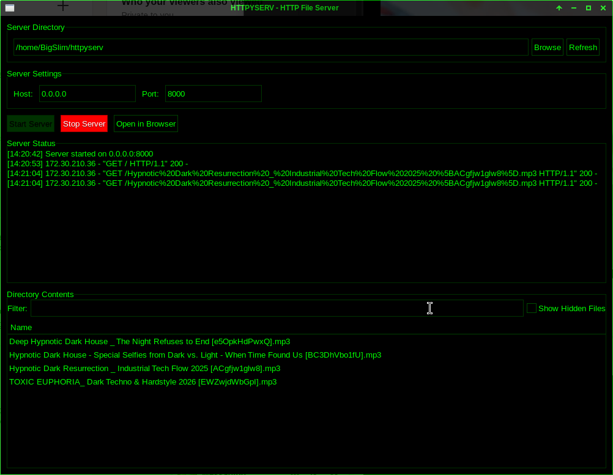

# HTTP File Server GTK

A lightweight, GUI-based HTTP file server built with Python 3 and GTK3.  
Allows serving local directories over HTTP, with real-time server status, file filtering, and persistent configuration.

---

## Features

- Start/stop HTTP server with a GUI
- Browse and serve any local directory
- View real-time server status (connections, downloads)
- Filter displayed files and optionally show hidden files
- Persistent configuration across sessions
- Open served directory directly in browser
- Logs all GET requests in the GTK UI

---

## Screenshots



---

## Requirements

- Python 3.8+
- PyGObject (GTK3 bindings)
- Standard Python libraries: `os`, `threading`, `http.server`, `configparser`, `datetime`, `pathlib`

### Install PyGObject

```bash
pip install PyGObject
```

On Linux, you may need development packages:

```bash
# Ubuntu/Debian
sudo apt install python3-gi python3-gi-cairo gir1.2-gtk-3.0

# Fedora
sudo dnf install python3-gobject gtk3
```

---

## Usage

1. Clone the repository:

```bash
git clone https://github.com/<your-username>/http-file-server-gtk.git
cd http-file-server-gtk
```

2. Run the server GUI:

```bash
python httpyserv
```

3. Select the directory you want to serve using the **Browse** button.  
4. Set host (default `0.0.0.0`) and port (default `8000`).  
5. Click **Start Server**.  
6. Open in browser using **Open in Browser** button.

7. Monitor real-time status of connections and downloads in the **Server Status** panel.

8. Use filters to quickly find files in the **Directory Contents** panel.

---

## Configuration

The server saves your settings in:

```text
~/.config/httpfileserver/config.ini
```

Includes:

- Last served directory
- Host and port
- Show hidden files setting

---

## Logging

All GET requests are logged in the GUI under **Server Status**, including:

- Client IP
- Requested file path
- Completion of download

Example log:

```text
[12:34:56] 192.168.1.10 requested /example.txt
[12:34:57] 192.168.1.10 completed download /example.txt
```

---

## Project Structure

```text
httpyserv/
├── httpyserv           # Main Python file
├── README.md           # This file
└── .venv/              # Optional Python virtual environment
```

---

## License

MIT License – see [LICENSE](LICENSE) for details.

---

## Screenshots

*(Optional: add screenshots of the GUI if desired)*

---

## Notes

- The server only handles GET requests for files.  
- Directory listings are displayed in the GTK GUI but are not exposed over HTTP.  
- Server must be stopped via GUI before exiting to save configuration properly.